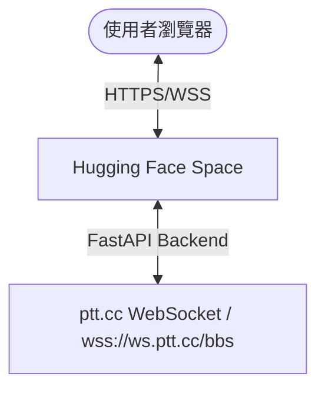

# PTT 跳板服務 (Hugging Face Space) 開發計畫

此專案旨在解決公司網路屏蔽 `ptt.cc` 的問題。我們將在 Hugging Face Space 上部署一個網頁端 PTT 代理伺服器（跳板），讓使用者可以透過 Hugging Face 的加密網域（`https://*.hf.space`）連線並流暢地瀏覽 PTT。

## 技術架構與方案

1. **後端 (Python FastAPI + websockets)**：
   - 建立一個輕量級 Web 伺服器，負責託管前端靜態資源，並提供 `/ws` WebSocket 代理端點。
   - 收到來自前端的連接時，向 `wss://ws.ptt.cc/bbs` 建立 Client 連線，並附帶 `Origin: https://term.ptt.cc` 標頭以通過 PTT 站方防禦。
   - **編碼轉換**：PTT 輸出為 Big5 (CP950) 編碼，我們在後端使用 Python 內建的 `codecs.getincrementaldecoder('cp950')` 將其解碼為 UTF-8 字串發給前端；使用者輸入的 UTF-8 字串則在後端編碼為 Big5 位元組流後發送給 PTT。
   - **安全訪問防護**：支援設定 `PROXY_PASSCODE` 環境變數。若設定，使用者連接 WebSocket 時必須驗證密碼，防止跳板被公開濫用。

2. **前端 (HTML5 + CSS3 + JS + xterm.js)**：
   - 使用 `xterm.js` 作為瀏覽器端終端模擬器，完美解析 BBS ANSI 色碼與操作。
   - **現代化極致視覺**：
     - 使用毛玻璃（Glassmorphism）與漸層背景設計現代感儀表板。
     - 提供**多種終端主題**切換（綠色矩陣、復古琥珀、極光暗黑、Cyberpunk 等）。
     - 提供調整字型大小（Font Size）的即時滑桿。
   - **連線狀態監控**：發光脈衝指示燈，即時反映連線中、已連線、已中斷等狀態。
   - **貼上小幫手 (Paste Helper)**：解決 BBS 無法直接貼上大量文字的問題，前端可以將剪貼簿文字分段分時送出，防止被 PTT 系統判定為洪流攻擊（Flooding）而斷線。
   - **虛擬按鍵輔助**：為行動裝置或快捷操作提供常用 BBS 按鍵（方向鍵、Enter、Esc 等）。

---

## 使用者審查與確認事項

> [!IMPORTANT]
> **1. 存取安全性**：
> 為保護您的 Hugging Face 資源不被他人盜用，我們強烈建議啟用 `PROXY_PASSCODE` 密碼保護。您只需在 Hugging Face Space 的 Settings 頁面新增一個 Environment Variable (Secret) `PROXY_PASSCODE=您的密碼`，即可鎖定服務。
> 
> **2. 部署環境**：
> Hugging Face Space 需要使用 **Docker SDK** 來運行 FastAPI。我們將為您準備好 `Dockerfile` , `requirements.txt` 與 `app.py`，您可以直接上傳部署。

---

## 預計變更檔案

### [myBBS](file:///d:/MyLab/myBBS)

#### [NEW] [requirements.txt](file:///d:/MyLab/myBBS/requirements.txt)
- 定義後端依賴：`fastapi`、`uvicorn`、`websockets` 等。

#### [NEW] [Dockerfile](file:///d:/MyLab/myBBS/Dockerfile)
- 設定 Python 3.10-slim 基礎映像檔，安裝套件並啟動服務於 Port 7860（HF Space 預設）。

#### [NEW] [app.py](file:///d:/MyLab/myBBS/app.py)
- FastAPI 主程式，包含靜態檔案路由、主頁訪問、WebSocket 代理邏輯與 Big5 轉碼處理。

#### [NEW] [static/index.html](file:///d:/MyLab/myBBS/static/index.html)
- 網頁前端結構，引入 `xterm.js` 及控制台 UI 框架。

#### [NEW] [static/style.css](file:///d:/MyLab/myBBS/static/style.css)
- 精美的毛玻璃、漸層背景與自定義終端樣式 CSS。

#### [NEW] [static/app.js](file:///d:/MyLab/myBBS/static/app.js)
- 處理 WebSocket 生命週期、xterm.js 實例化、貼上小幫手邏輯、密碼輸入儲存及主題更換。

#### [MODIFY] [.ai_rules.md](file:///d:/MyLab/myBBS/.ai_rules.md)
- 更新專案地圖以反映實際的專案檔案結構。

---

## 驗證計畫

### 本地測試方法
1. 安裝套件：`pip install -r requirements.txt`
2. 啟動伺服器：`python -m uvicorn app:app --reload --port 7860`
3. 瀏覽器開啟 `http://localhost:7860`
4. 測試連線、ANSI 色碼顯示、中文字元輸入、主題切換及密碼防護功能。

### 部署至 Hugging Face Space 步驟
1. 在 HF 建立 Docker Space。
2. 上傳本專案全部檔案。
3. 於 Space Settings 設定 `PROXY_PASSCODE`。
4. 訪問 Space 網域進行最終測試。
